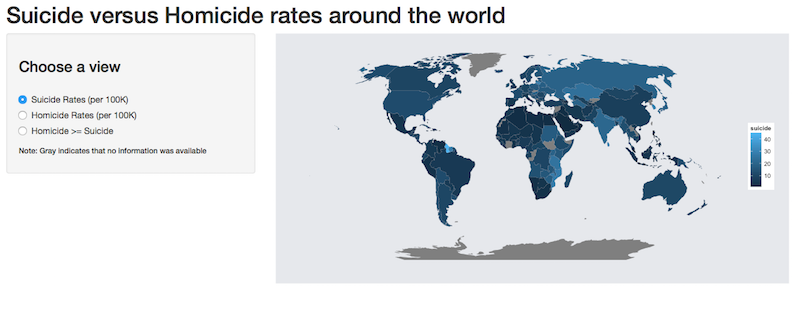
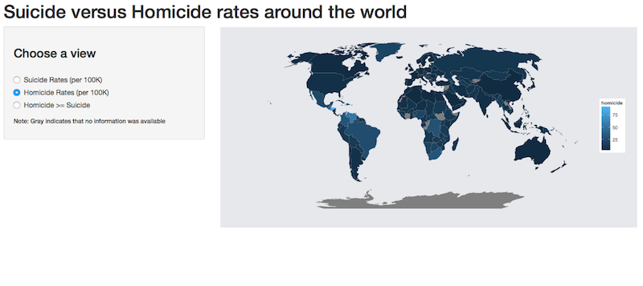
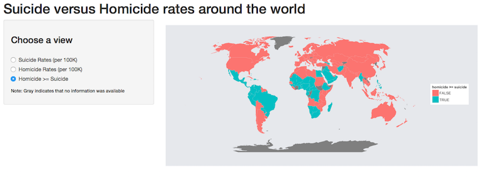

## Homicide v Suicide

In many countries, suicide rates are much higher than homicide rates.

However, in other countries the converse is true. This app gives a user a few different ways to view which country shows which pattern and by how much.

Users select a view using a radio button. Potential views are:

1. Homicide rates by country in number of homicides per 100,000 people
2. Suicide rates by country in number of suicides per 100,000 people
3. Countries where homicide rate exceeds suicide rate and vice versa

--- .class #id 

## View 1

 

---

## View 2

 

---

## View 3

 

--- &twocol

## Pros and cons to this app

***=left

####Pros

* Views not registered when switching
* Not all countries included
* Good projection
* Generalizable to arbitrary country data

***=right

####Cons (or future work)

* Three different views of the same data
* Easy to understand

---

